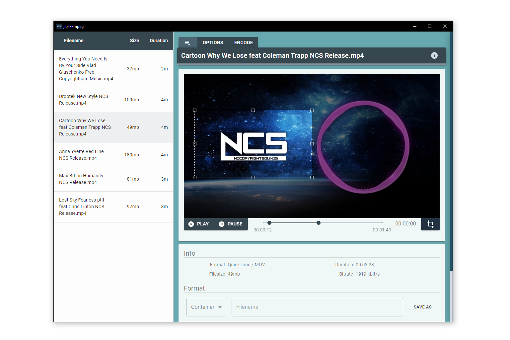

# jib-FFmpeg

*Yet another graphical user interface for FFmpeg...*

**It is far from being finished and is still under development. You will find bugs and a lack of features to improve user experience.**

### Node.js and Electron
This software uses [Node.js](https://nodejs.org/en/) and [Electron](https://electronjs.org/) to utilize JavaScript, HTML, and CSS for cross platform desktop apps.


### FFmpeg
> This software depends on [FFmpeg](https://www.ffmpeg.org/), so an installed version of FFmpeg is required and the directory to the binaries must be added to the path variable.

---


---

### Features
The start and end time can be set via a slider. You can play the audio / video file to make it easier to find the desired time period. In addition, there is a possibility to crop the video content.

Convert from and to *.mkv*, *.avi*, *.mp4*, *.webm*, *.mov*, *.mpeg*, *.mp3*, *.ogg*, *.ac3*, *.weba*, *.wav* with any codec supported by the format. You can also adjust the resolution of video content, the sample rate for audio content and the bit rate.

It is possible to edit several files at once, for instance if you want to convert different files into the same format.

---
#### Initialize
```
npm install
```
*or with yarn*
```
yarn install
```

#### Starting jib-FFmpeg
```
npm start
```
*or with yarn*
```
yarn start
```

---
#### Create Package
```
npm run package
```
*or with yarn*
```
yarn package
```

#### Create Installer
```
npm run make
```
*or with yarn*
```
yarn make
```
